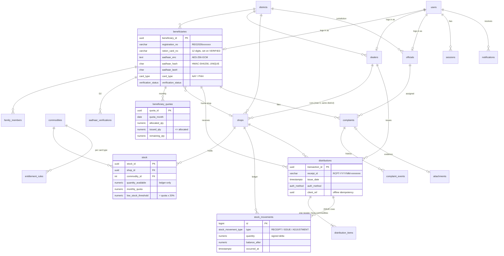

# SRMS Database

PostgreSQL 16 · [Drizzle ORM](https://orm.drizzle.team) · plain SQL migrations

The schema implements the tables from the **Low-Level Design (§5 Database Layouts)** and the data
stores **D1–D7** from the DFDs, then adds what a production system needs: authentication,
districts, entitlement rules, an immutable stock ledger, complaint history and an outbox for SMS.

| Where | What |
| --- | --- |
| `backend/database/src/schema.ts` | Tables, enums, indexes, CHECK constraints (TypeScript, generates `0000_init.sql`) |
| `backend/database/migrations/0001_business_rules.sql` | Triggers, functions and views that enforce the SRS rules |
| `backend/database/src/bootstrap.ts` | Production reference data + first System Admin (idempotent) |
| `backend/database/src/seed.ts` | Demo data for Bihar (never runs in production unless `SEED_DEMO=true`) |
| `backend/database/test/*.test.ts` | 23 tests proving every rule below |

## Entity–relationship diagram



### LLD → implementation mapping

| LLD table | Implemented as | Changes and why |
| --- | --- | --- |
| Beneficiary | `beneficiaries` + `family_members` | `aadhaar_no` → encrypted + hashed + last-4 (R15); `family_details` normalised into rows so quotas can use family size |
| Dealer | `dealers` | + `district_id` (R11 same-district rule), `user_id` for login |
| Shop | `shops` | `district` → FK to `districts`; `monthly_allocation` kept per commodity in `stock.monthly_quota` |
| Commodity | `commodities` | + Hindi name, price, active flag |
| Stock | `stock` + `stock_movements` | quantity can only change through the append-only ledger (R19 anti-leakage) |
| BeneficiaryQuota | `beneficiary_quotas` | generated from `entitlement_rules` (NFSA: PHH 5 kg/person, AAY 35 kg/family) |
| Distribution | `distributions` + `distribution_items` | one receipt per visit, one item per commodity; `receipt_id` generated |
| Complaint | `complaints` + `complaint_events` | + ticket number, auto-routing, full status history |
| Notification | `notifications` | used as a transactional outbox for the SMS worker |
| AuditLog | `audit_logs` | written by triggers, append-only, no secrets |
| — (D2) | `aadhaar_verifications` | every UIDAI authentication attempt |
| — | `users`, `sessions`, `otp_challenges`, `officials`, `districts`, `settings`, `attachments` | login, RBAC, config |

## Business rules enforced inside Postgres

The API validates first to give friendly messages, but the database has the final word: API
bugs, offline sync and direct SQL all go through the same rules. Errors come back as
`SRMS_<CODE>: message` and the API maps them to HTTP status codes.

| Requirement | Rule | Error code |
| --- | --- | --- |
| R11 / FR-5 | A dealer runs at most **3 active shops** (setting `max_shops_per_dealer`), all in **their own district**; dealer row is locked so concurrent assignments can't race | `DEALER_SHOP_LIMIT`, `SHOP_DISTRICT_MISMATCH`, `DEALER_INACTIVE` |
| FR-3 (2.1) | Only **Aadhaar-verified, active** beneficiaries can receive ration | `BENEFICIARY_NOT_ELIGIBLE` |
| R16 | Only the dealer **assigned to the shop** can issue from it | `DEALER_SHOP_MISMATCH` |
| FR-3 (2.2) | Issued quantity can never exceed the **monthly quota** (row-locked) | `QUOTA_EXCEEDED`, `NO_QUOTA` |
| FR-3 (2.3) | Shop stock can never go negative | `INSUFFICIENT_STOCK` |
| FR-3 (2.4) | Header + items + quota + stock + ledger happen in **one transaction**; a receipt with no items is rejected at commit | `INVALID_MOVEMENT` |
| R19 | `stock.quantity_available` changes **only via `stock_movements`**; ledger rows can't be edited or deleted | `STOCK_DIRECT_UPDATE`, `IMMUTABLE_RECORD` |
| — | Distributions can't be edited or deleted — only **voided**, which returns quota and stock through the ledger | `IMMUTABLE_RECORD`, `INVALID_TRANSITION` |
| R5 / FR-4 | When stock drops below **20 % of the monthly quota** (setting `low_stock_pct`), the dealer is alerted **once**; the alert re-arms after replenishment | — |
| R8 corrected / FR-7 | "Registration received" SMS on sign-up; "approved" SMS + ration card number **only after** Aadhaar verification | — |
| FR-9 | Complaints get a ticket number, are routed to the **least-loaded official of the shop's district** (state level as fallback), follow OPEN → IN_PROGRESS → RESOLVED/REJECTED, and need a resolution note to close | `INVALID_TRANSITION` |
| NFR-4 | Changes to users, beneficiaries, dealers, shops, officials, commodities, entitlements, settings, stock quotas, adjustments, voids and complaint updates are written to `audit_logs` with **who / role / what changed**; Aadhaar and password hashes are never copied; audit rows are append-only | `IMMUTABLE_RECORD` |
| R15 | Aadhaar stored as AES-256-GCM ciphertext + HMAC hash (duplicate check) + last 4 digits; keys live only in the API environment | `UNIQUE_VIOLATION` on duplicates |

## Reporting views (FR-6 dashboard, FR-8 reports)

| View | Use |
| --- | --- |
| `v_distribution_lines` | one row per commodity line of every receipt, with month, shop, district |
| `v_stock_status` | live stock per shop/commodity with `is_low` and `% of quota` |
| `v_shop_month_ledger` | received / issued / reversed / wastage / **leakage** per shop, commodity and month |

**KPI definitions** used by the dashboard:

- **Coverage %** = beneficiaries served in the month ÷ verified active beneficiaries × 100
- **Offtake %** = quantity issued ÷ quantity allocated (quotas) × 100
- **Leakage %** = unexplained shortages (`INSPECTION_SHORTAGE` + negative `CORRECTION`) ÷ quantity received × 100
- **Wastage %** = recorded `DAMAGE` + `EXPIRY` ÷ quantity received × 100

## Running it

```bash
pnpm install
pnpm db:up                 # local Postgres in Docker (or use your own)
cp backend/database/.env.example backend/database/.env   # then fill in the two Aadhaar secrets
pnpm db:deploy             # apply migrations
pnpm db:bootstrap          # districts, commodities, entitlements, settings, first admin
pnpm db:seed               # optional demo data
pnpm db:test               # rule tests (uses TEST_DATABASE_URL, default …/srms_test)
```

Changing the schema: edit `src/schema.ts` → `pnpm --filter @srms/database generate` → review the new SQL
in `migrations/` → commit. For triggers/functions use `pnpm --filter @srms/database generate:custom`.

### Production notes

- **Neon**: `DATABASE_URL` = pooled host (`…-pooler…`), `DIRECT_URL` = direct host (used by migrations).
- Migrations run on every deploy (`pnpm db:deploy`); they are transactional and idempotent.
- `pnpm db:reset` refuses to touch a non-local database unless `ALLOW_DB_RESET=true`.
- Hardening option: run the API as a least-privilege role without `UPDATE` on `stock`,
  `stock_movements` and `audit_logs`, with the trigger functions `SECURITY DEFINER`.
